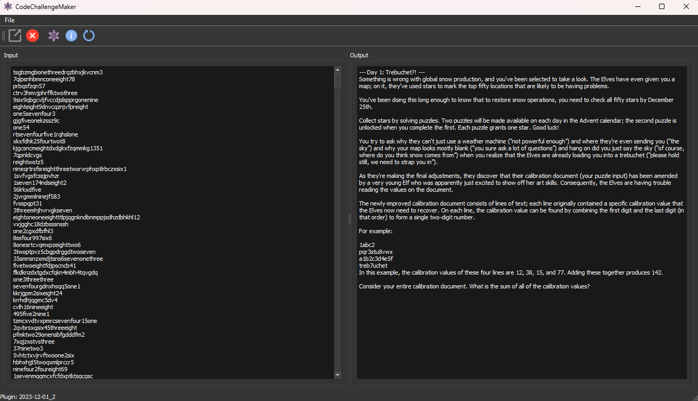

# CodeChallengeMaker

A little Qt5-app for making and running code challenges that can be implemented with a plugin

## Pre-requisites

* Qt5
* (current version of) CMake
* a compiler that can compile C++17

## Supports

* Windows
* Linux (although no VSCode launch configs are provided)

## Features

* A simple UI with an input field, an output field and a few buttons
* An interface for writing plugins (example/ExamplePlugin serves as a template)
* All the boilerplate for the build system, the Qt and the plugins is already there
* The separated plugin system allows for further metrics like cycles, memory footprint and execution time (not yet implemented)
* Note: I've put my solutions into a private submodule, so you don't get spoilers
* This is 'just' the app and the frame for writing your own solutions

## How to use
* copy the example plugin into 'plugins' and rename it to match the challenge.
* Set the name in the CMakeLists.txt as well (in `project(Challenge2023-12-01_1)`)
* copy the description into the resources/descriptionFile.txt (optional)
* copy the input into the resources/inputFile.txt (optional)
* implement your solution inside `ChallengeResult ChallengePlugin::runChallenge(const QString& _pInput)`
* Open the App and click on 'Load Plugin' - select your plugin dll/so and you can execute/debug.

## Future work
 
* Drag and Drop for the input file (if any)
* plugin hot-reloading & self-compiling
* The plugin interface's external virtual execution function will not be run from outside.
  * instead there will be a surrogate function that will be run from outside and will call the virtual function
  * this will alow for isolated metrics measurement
